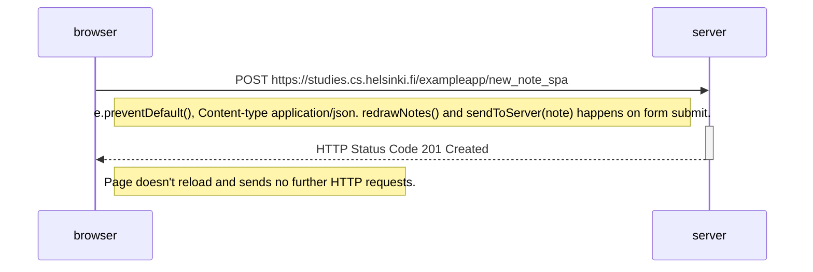

```mermaid
sequenceDiagram
  participant browser
  participant server
    browser->>server: POST https://studies.cs.helsinki.fi/exampleapp/new_note_spa
    Note right of browser: e.preventDefault(), Content-type application/json. redrawNotes() and sendToServer(note) happens on form submit.
    activate server
    server-->>browser: HTTP Status Code 201 Created 
    deactivate server

    Note right of browser: Page doesn't reload and sends no further HTTP requests. 
```